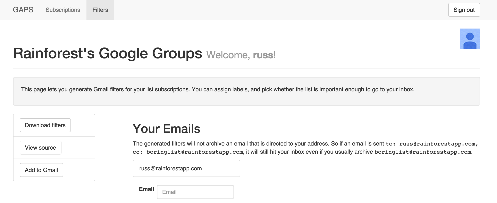

# Gaps

Easy management of your Google Apps email configuration.

# Overview

At Stripe, we've long had many
[more Google Group mailing lists than employees](https://stripe.com/blog/email-transparency). As
the number of lists grew, so too did the complexity of managing your
email setup: which lists were you on? Why are you receiving email for
this list you're not subscribed to? How do you set up your filters to
usually archive email to a list, but only if you're not present on the
CC?

Gaps is the main tool we've used to help make these questions
manageable. The core functionality is surprisingly simple: a single
list of all your Google Groups in one place, which lets you view your
subscriptions (including whether you're receiving mail from a list
being subscribed to another list), and subscribe or unsubscribe by the
click of a button.

More recently, we've also added filter generation and
maintenance. Unfortunately Google's email settings API only allows you
to create new filters, so it's up to the user to delete their old
ones.

# What it looks like

# Configuring

Create a `site.yaml` with your local settings: `cp site.yaml.sample
site.yaml`. You'll need:

- A Google application. See instructions below, and then update
  `site.yaml`.
- A running MongoDB instance. Gaps stores some soft state (cache of
  what it gets out of the API), but also has some hard state (the
  categorization of your groups, people's filter settings). Update
  `site.yaml` appropriately.
- (At runtime) an admin account on your Google Apps domain.

## Creating a Google application

1. Make sure you have
  [API access](https://support.google.com/a/answer/60757?hl=en)
  enabled for your Google Apps domain.
2. Create a
   [new project](https://console.developers.google.com/project).
3. Under the "APIs & auth" accordion for that project, select the
   "APIs" tab. Enable the Google+ API, Admin SDK, and Group Settings
   API.
4. Under the same accordion, select the "Credentials" tab. Create a
   new "Web application" Client ID. Add your desired redirect URI and
   authorized origins. (In development that'll probably be
   `http://localhost:3500` and `http://localhost:3500/oauth2callback`,
   respectively.)
5. Copy your client ID and client secret into your `site.yaml` file.

# Running

You can run Gaps directly or under Docker.

## Running directly

Run `bundle install` to install your dependencies. Gaps should run on
Ruby 1.9 and up. Then execute `bin/gaps_server.rb` (or
`bin/dev-runner` if you want auto-reloading upon code changes).

## Running on Heroku

Just click here: 

## Running under Docker

First, you need to configure Gaps by creating a `.env` file and filling in your configuration:

    ORG_DOMAIN=
    ORG_NAME=
    OAUTH_CLIENT_ID=
    OAUTH_CLIENT_SECRET=
    OAUTH_REDIRECT_URL=
    SESSION_SECRET=

To run a local development environment, you can use Docker Compose:

    $ docker-compose up

To run in production, you can just run the image on Docker Hub:

    $ docker run -p 80:3500 --env-file=.env stripeoss/gaps

# Permissions

Gaps uses your domain admin's credentials to perform most actions
(listing all groups, joining a group). So permissions are entrusted to
Gaps's business logic rather than your Google settings directly.

Gaps currently comes with two schemes to mark a list as private. Any
private lists are currently completely omitted from Gaps: they'll be
left out of the directory listing, their creation won't be emailed
about, and users won't be able to join them.

The first is the Gaps-custom scheme, which grew out of Stripe's desire
for a very lightweight private-group creation. It's probably a
reasonable place to start if you are starting with very few private
lists:

- Prefixing the name with `private-`.
- Prefixing the name with the less-cumbersome but more-obscure `acl-`.
- Suffixing the name with `-confidential`.
- Adding a JSON tag as the last line of the group description with a
  "display" setting as follows: `{"display": "none"}`

The second is using the Google Groups Settings API. This checks that
the group is set to be shown in the group directory, that anyone in
the domain can join, and that anyone in the domain can view it.

Choose your privacy schemes using the Configatron keys under
`permissions.privacy_settings`.

# Contributions

Patches welcome! There are many features that would be useful that
Gaps doesn't yet support. For example:

- Managing your group settings: generally you probably want all of
  your lists to have a standard set of configuration (such as Public
  posting, etc). Gaps could ensure that all lists in your domain have
  the appropriate settings.
- More flexible filter generation, or better story for clearing
  filters.
- Displaying your private lists.
- Fully AJAX-ify the UI. As you can tell, there's still a lot of
  low-hanging fruit on the UI.

# Contributors

- Amber Feng
- Andreas Fuchs
- Brian Krausz
- Carl Jackson
- Evan Broder
- Greg Brockman
